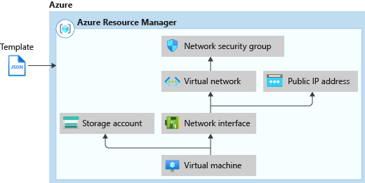
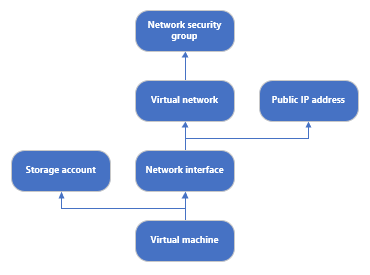

# readme

Tutorial - create arm templates with dependent resources. From: <https://docs.microsoft.com/en-us/azure/azure-resource-manager/templates/template-tutorial-create-templates-with-dependent-resources?tabs=CLI>

* ARM template diagram

    

* Another view

    
